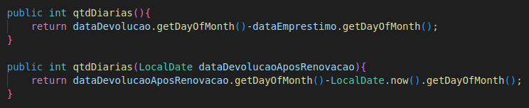

# Revisando conceitos de Orientação a Objetos

Neste projeto será apresentado conceitos básicos de orientação a objetos. 

A abordagem destes conceitos será feita em três momentos:

[Caso de Uso](#caso-de-uso)

[Diagrama de Classes](#diagrama-de-classes)

[Implementação](#implementação)

## Caso de Uso 

**Objetivo:** Descrever textualmente o problema a ser trabalhado. 

Criar um projeto que implemente um sistema de uma biblioteca, onde será possível gerenciar empréstimos, livros e leitores. 

## Diagrama de Classes

**Objetivo:** Utilizar modelagem UML para descrever visualmente qual solução será adotada para resolver o problema descrito no Caso de Uso.

## Implementação 

**Objetivo:** Implementação do sistema utilizando Java.

### Conceitos de Orientação a Objetos:

* **Encapsulamento**

    Os atributos de uma classe não podem ser acessados diretamente, e para garantir isso é preciso torná-los privados (private).\
    E criar métodos para consulta-los e altera-los (getters and setters).

    

* **Associação**

    Define um vínculo que ocorre entre classes.

    

* **Construtor**

    Para garantir que algumas regras de negócio sejam seguidas quando criamos um objeto, definimos o Construtor de uma Classe.\
    Assim podemos definir quais atributos são obrigatórios quando um objeto for instânciado.

    

    

* **Atributo Estático**

    Atributos estáticos são atribuidos à classe principal e não aos objetos desta classe, 
    e geralmente são utilizados quando é necessário contabilizar quantos objetos foram criados.

    

* **Herança**

    Quando temos uma classe que precisa utilizar os atributos e métodos de uma outra classe utilizamos o conceito de herança.\
    Assim, quando uma classe, definida como subclasse, herda(extends) os atributos e métodos de uma outra classe, definida como superclasse,
    dizemos que esta classe é filha da classe herdade(classe mãe).\
    Observação: As subclasses não herdam os construtores da superclasse.

    

    

    

    

* **Sobrescrita**

    Quando uma subclasse deseja utilizar um método pertencente a superclasse, porém com alguns ajustes para se adequar a classe filha,\
    podemos reescrever este método com as devidas alterações, manténdo o mesmo nome do método pertencente a classe mãe.\
    Observação: Para que uma subclasse acesse diretamente um atributo da super classe é preciso que este esteja definido com visibilidade protected.\
    Observação: Uma subclasse também pode se referir a um atributo da superclasse utilizando o prefixo super (Ex: super.nome_atributo)

    

    

    

* **Sobrecarga**

    Quando desejamos ter vários métodos com o mesmo nome, porém cada um destes receber uma quantidade de parâmetros diferente, utilizamos o conceito de sobrecarga de método.

    

* **Polimorfismo**

    Os conceitos de Sobrescrita e Sobrecarga podem ser agrupados com o nome de Polimorfismo.\
    Polimorfismo acontece quando temos mais de um método, em uma mesma classe, com o mesmo nome, contanto que ele possua uma passagem de\
    parâmetros diferente, ou quando um método mais específico sobrescreve o Método de uma superclasse.\
    O conceito de Polimorfismo também pode ser visto quando um método exige como parâmetro uma superclasse, mas passamos como parâmetro uma subclasse.

    IMAGEM

* **Classe Abstrata**

    Uma classe que não pode ter objetos instânciados é chamada de classe abstrata.\
    Por exemplo, a classe Leitor e a classe Bibliotecario herdam os atributos e métodos da classe Pessoa como vimos anteriormente.\ 
    Será instânciado objetos do tipo Leitor e do tipo Bibliotecário mas não queremos objetos apenas do tipo Pessoa, pois esta serve apenas para disponibilizar 
    os atributos e métodos comuns as classes filhas.\
    Logo a classe Pessoa pode ser definida como sendo uma classe abstrata (abstract).

    

    

* **Método Abstrato**

    Os métodos de uma classe abstrata nunca serão executados mas queremos garantir que todas as subclasses implemente-os.
    Para isso é preciso defini-lo como método abstrato (abstract).

    
